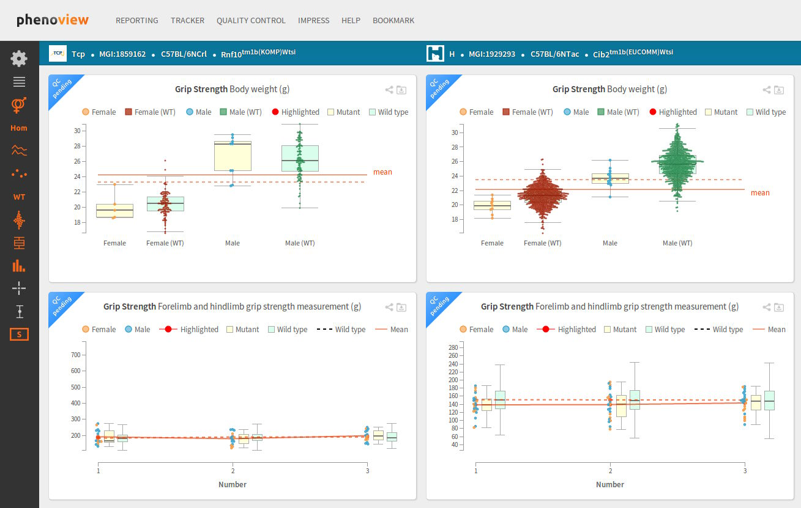

# Phenoview

**Phenoview** is a tool for comparative visualisation of phenotype
data. It provides an interactive user interface through which mouse
phenotype data can be visualised, analysed and understood.

## Salient features

A few of the features provided by _Phenoview_ are:

* It allows a user to simultaneously view data from multiple centres
  for multiple [parameters](https://www.mousephenotype.org/impress).
* It is a web-based tool which is accessible from anywhere around the world
  using a modern internet web browser.
* It provides facilities to download the raw data, for further analysis.
* Visualisations can be bookmarked and shared.

The following are example visualisations:

* [The home page (no gene/parameter selected)](https://www.mousephenotype.org/phenoview/)

* [Example with gene/parameter selected](https://www.mousephenotype.org/phenoview/?gid=377-35-4,86-19-11,1259-18-12,1058-18-12,171-35-3,151-61-7,220-19-8&qeid=IMPC_CSD_031_001,IMPC_GRS_002_001,IMPC_GRS_003_001&ctrl=1030625)

Please [contact us](https://www.mousephenotype.org/contact-us) for further details.

